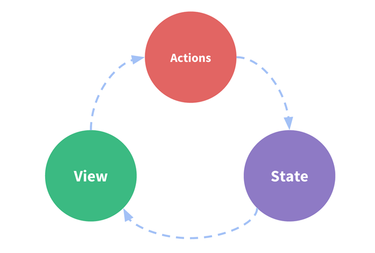

# vue_vux_vuex入门
本人是从事android研发的，明显感受到h5带来的冲击，从学习angular到react到最近的vue，发现vue集成了前两者的两大优点，并以轻量级自居，为前端开发带来了极大方便和体验，同时weex支持vue语法，也促使本人潜心学习vue，学海无涯，希望大家点赞哈，本人以后会多点积累为大家提供更多的学习参考demo，转发一定的著名作者哈：马小鹏 marco 谢谢支持。
## vue简介
Vue.js（读音 /vjuː/，类似于 view） 是一套构建用户界面的渐进式框架。与其他重量级框架不同的是，Vue 采用自底向上增量开发的设计。Vue 的核心库只关注视图层，它不仅易于上手，还便于与第三方库或既有项目整合。另一方面，当与单文件组件和 Vue 生态系统支持的库结合使用时，Vue 也完全能够为复杂的单页应用程序提供驱动。
### 优点：
* 简洁： HTML 模板 + JSON 数据，再创建一个 Vue 实例，就这么简单。
* 数据驱动： 自动追踪依赖的模板表达式和计算属性。
* 组件化： 用解耦、可复用的组件来构造界面。
* 轻量： ~24kb min+gzip，无依赖。
* 快速： 精确有效的异步批量 DOM 更新。
* 模块友好： 通过 NPM 或 Bower 安装，无缝融入你的工作流。

### 创建vue
使用 npm 安装:

```
# 最新稳定版
$ npm install vue
# 全局安装 vue-cli
$ npm install --global vue-cli
# 创建一个基于 webpack 模板的新项目
$ vue init webpack my-project
# 安装依赖，走你
$ cd my-project
$ npm install
$ npm run dev （支持实时刷新，你可以边编写代码修改样式 实时看到浏览器页面中的数据变化）
```
### 简单实例
vueapp.htm 文件代码：

```
 <div id="app">
  <p>{{ message }}</p>
  <input v-model="message">
</div>
```
vueapp.js 文件代码：

```
new Vue({
  el: '#app',
  data: {
    message: '菜鸟教程!'
  }
})
```
从实例可以看出vue集成了angular的数据绑定机制

## vux简介
Vux（读音 [v'ju:z]，同views）是基于WeUI和Vue(2.x)开发的移动端UI组件库，主要服务于微信页面。
基于webpack+vue-loader+vux可以快速开发移动端页面，配合vux-loader方便你在WeUI的基础上定制需要的样式。
其提供了大量丰富的ui组件供使用，大大简便了ui开发成本，其预览地址：`https://vux.li/demos/v2/?x-page=v2-doc-home#/`

### 创建vux
使用如下airyland/vux2模版进行安装，其集成了vue2.0、vux2.0、vuex2.0、vue-router等包，无需再手动添加。
使用 npm 安装:

```
npm install vue-cli -g // 如果还没安装
vue init airyland/vux2 projectPath

cd projectPath
npm install --registry=https://registry.npm.taobao.org
npm run dev
```
## vuex简介
如果学过react的话，一定对redux不陌生，其实vuex和redux原理一样，充当一种状态管理模式，它采用集中式存储管理应用的所有组件的状态，并以相应的规则保证状态以一种可预测的方式发生变化。Vuex 也集成到 Vue 的官方调试工具 devtools extension，提供了诸如零配置的 time-travel 调试、状态快照导入导出等高级调试功能。

这个状态自管理应用包含以下几个部分：

* state，驱动应用的数据源；
* view，以声明方式将state映射到视图；
* actions，响应在view上的用户输入导致的状态变化。

以下是一个表示“单向数据流”理念的极简示意：





### 实例讲解
在本demo中首先创建store.js，在入口文件main.js中引入store.js，实例vue的时候加入store进行注册，这样即可全局使用。在Demo2.vue中 通过一个小小的计算实例为大家演示了从view->action->state－>view的过程演变，如果其他组件或页面需要调用到store中的count属性 `$store.state.count`即可，这样能实时捕捉到其状态变化，当你在Demo2.vue中对count属性进行计算时，比如`increment` （注意需在Demo2.vue中通过mapAction将辅助函数映射进来，在store.js中添加action对应的方法），触发`increment` 后会执行`commit('increment')` 从而发送type给到`mutation`进而改变`属性count`的状态，从实现view中的展示数据变化。


 
